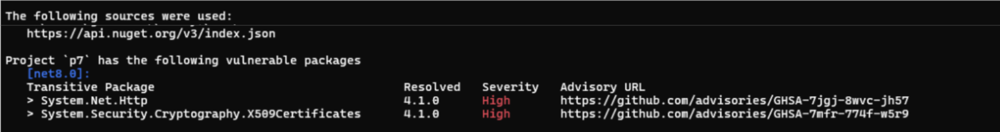

# ***Enable AuditSource during `dotnet list package` command***
<!-- Replace `Title` with an appropriate title for your design -->

- Author Name [Nigusu](https://github.com/Nigusu-Allehu)
- [GitHub Issue](https://github.com/NuGet/Home/issues/13767) <!-- GitHub Issue link -->

## Summary

Enable the use of `<AuditSources>` in the `dotnet list package --vulnerable` command to identify vulnerable packages in a project. 
Currently, the command only queries vulnerability data from the Registration API of `<PackageSources>` defined in the NuGet.config file. 
This proposal extends functionality to include `<AuditSources>` for improved flexibility and accuracy in vulnerability detection.

## Motivation

Currently, `<AuditSources>` specified in NuGet.config are ignored during the execution of `dotnet list package --vulnerable`. 
This limits the ability of users to leverage specialized audit sources for vulnerability data. Supporting `<AuditSources>` will:

- Provide more flexibility to users by allowing alternate sources for vulnerability data.
- Enhance the accuracy of vulnerability detection by using dedicated audit sources.
- Maintain backward compatibility by falling back to the current behavior if `<AuditSources>` are not specified.

It is important to note that the current implementation of dotnet list package uses `<PackageSources>` only, which currently rely on the Registration API to fetch vulnerability data.
Addressing this limitation is a broader issue we would like to resolve in the future (see [#13026)](https://github.com/NuGet/Home/issues/13026). 
This proposal, however, focuses solely on adding support for `<AuditSources>`, which will utilize the VulnerabilityInfo resource of the specified sources.

## Explanation

### Functional explanation

#### Scenario 1: User specifies both `<AuditSources>` and `<PackageSources>`

**User Action:**

- Specifies `<AuditSources>` and `<PackageSources>` in NuGet.config.
- Runs `dotnet list package --vulnerable`.

**Expected Behavior:**

- If `<AuditSources>` contains an endpoint supporting the VulnerabilityInfo resource, NuGet will prioritize it as the primary source for vulnerability data.
  - If the source does not support the VulnerabilityInfo resource, the command will log a warning indicating the source does not have a `VulnerabilityInfo` resource. This will follow the status quo for restore and log [NU1905](https://learn.microsoft.com/en-us/nuget/reference/errors-and-warnings/nu1905).
- The command will iterate through all packages in the project, identify vulnerabilities, and list them along with the sources used for vulnerability information.
- Sources(Audit sources) used in this process are logged the way `PackageSources` that are used for vulnerabilities are logged.
- The output, including JSON format, will reflect the sources used for vulnerability data.

#### Scenario 2: User specifies `<PackageSources>` only

**User Action:**

- Specifies `<PackageSources>` in NuGet.config.
- Runs `dotnet list package --vulnerable`.

**Expected Behavior:**

- The command behaves as it currently does, using the Registration API of `<PackageSources>` to fetch vulnerability data.
- Performs per-package HTTP requests to retrieve vulnerability information. As mentioned earlier this is an issue we would like to address in a separate [work item](https://github.com/NuGet/Home/issues/13026)

### Technical explanation

#### Logic Flow

1. **Trigger:** The `dotnet list package --vulnerable` command is executed.
2. **Check for `<AuditSources>`:**
   - If `<AuditSources>` are specified, verify if they support the VulnerabilityInfo resource.
   - Use `<AuditSources>` to load vulnerability data if supported.
3. **Fallback:** If `<AuditSources>` are unavailable, fallback to default behavior of using PackageSources.
4. **Warn:** If the `<AuditSources>` do not support VulnerabilityInfo resource:
   - Log a waning [NU1905](https://learn.microsoft.com/en-us/nuget/reference/errors-and-warnings/nu1905).

   > warning NU1905: Audit source 'Contoso' did not provide any vulnerability data.

5. **Output:** List identified vulnerabilities and the sources used.

#### Changes to our Code

**File:** `ListPackageCommandRunner.cs`

1. **Update `ExecuteCommandAsync` Method:**
   - Add an `AuditSources` argument to the method signature.
2. **Addition of Vulnerability Data Download:**
   - Execute only when `dotnet list package --vulnerable` is run.
   - Check for the availability of `<AuditSources>`.
     - If available, use these sources to list vulnerable packages and return early.
     - If unavailable, fallback.
     - If unsupported, warn.

## Drawbacks

- Increases complexity in the `dotnet list package` command by introducing additional logic for `<AuditSources>`.

## Rationale and alternatives

<!-- Why is this the best design compared to other designs? -->
<!-- What other designs have been considered and why weren't they chosen? -->
<!-- What is the impact of not doing this? -->

- Ignoring `<AuditSources>` entirely: This would maintain the current implementation but miss an opportunity to enhance functionality.

## Prior Art

<!-- What prior art, both good and bad are related to this proposal? -->
<!-- Do other features exist in other ecosystems and what experience have their community had? -->
<!-- What lessons from other communities can we learn from? -->
<!-- Are there any resources that are relevant to this proposal? -->
- Existing implementations of `dotnet list package --vulnerable` that rely solely on `<PackageSources>`.

## Unresolved Questions

<!-- What parts of the proposal do you expect to resolve before this gets accepted? -->
<!-- What parts of the proposal need to be resolved before the proposal is stabilized? -->
<!-- What related issues would you consider out of scope for this proposal but can be addressed in the future? -->

## Future Possibilities

<!-- What future possibilities can you think of that this proposal would help with? -->
- We plan to address https://github.com/NuGet/Home/issues/13767 and have dotnet list package --vulnerable prioritize using VulnerabilityInfo resources when available.
