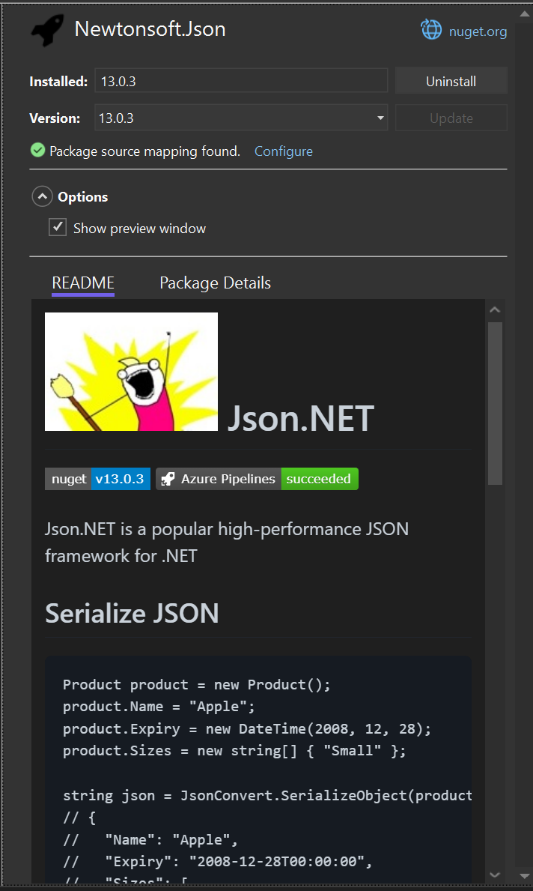
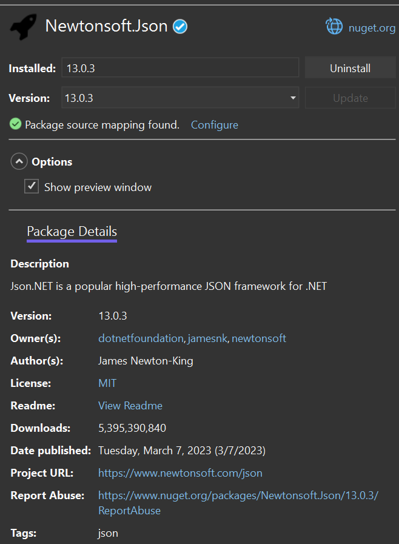
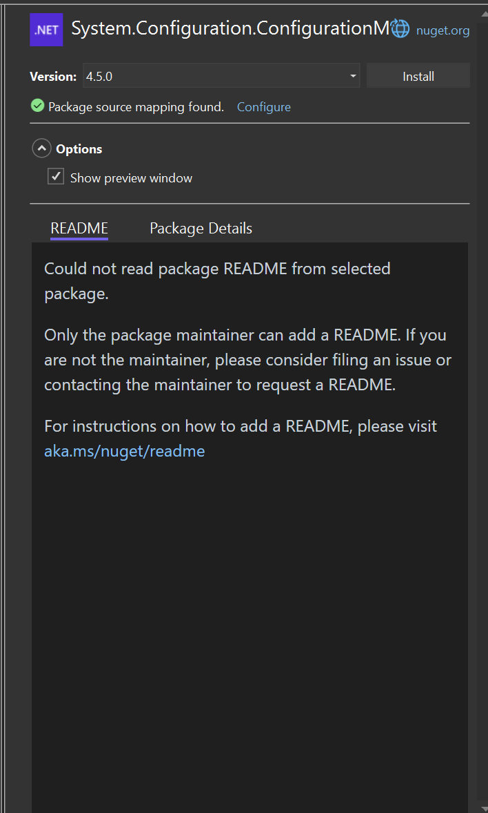

# Markdown README Rendering in PM UI

- Jonatan Gonzalez ([jgonz120](https://github.com/jgonz120)) 
- Issue [#12583](https://github.com/NuGet/Home/issues/12583) <!-- GitHub Issue link -->
- [Feature Spec](https://github.com/NuGet/Home/blob/7943122dffa435f4daeee600efcc5b744cd2e97e/accepted/2023/PMUI-README-rendering.md)

## Summary

We want to update the packages pane in the PMUI to render the README for the selected package. 
We also need to update the Nuget Server API to provide a link to download the README directly, without having to download the nupkg first.

## Motivation 

The README file is an essential source of information that can help customers understand what a package does.
By rendering the README file directly in the PM UI, customers can easily access the information they need to determine if a package will be helpful to them while searching, browsing, and managing their projects’ packages.
This enhancement streamlines the user experience and may encourage package authors to create comprehensive README documentation when customers will be more likely to rely on it for useful information about the package.

## Explanation
### Functional explanation

The PM UI will be updated to have tabs for the Package Details and the the README.
The README will be available in all the PM UI tabs.
It will also be displayed for both the solution level and project level package managers.




#### README Tab
This tab is rendered if a remote source available to download the readme or the Installed tab is selected and the selected version is found in the global packages folder.
This is to ensure that users using the Browse tab will not see the README tab if they do not have a remote source that allows README downloads.

If the README tab is rendered and we do not find a README then a message is rendered encouraging the user to contact the package author to upload a README.


If there is an error rendering the README then a message will be displayed for the users.  

#### Package Details
This tab is always rendered and contains the package details information along with the Vulnerabilty and Depreciation information. 

#### README File Sources

* ReadmeFileUrl in the [package metadata](https://learn.microsoft.com/en-us/nuget/api/registration-base-url-resource).
* README direct download specified in a new resource `ReadmeUriTemplate`.
* Downloaded nupkg.

### Technical explanation
#### Rendering Markdown

We will use the `IMarkdownPreview` control to render the README in the IDE.

#### Locating the README

Create a new implementation of the `INuGetResource` interface, `ReadmeUriTemplateResource`.
This will only be available for sources which have implemented the new `ReadmeUriTemplate` resource type.

Update `IPackageSearchMetadata` to include the `ReadmeFileUrl` field. 
`LocalPackageSearchMetadata` will populate the field using the README location specified in the package nuspec. If the README is defined as a text file it will be rendered as if it were markdown.
When a server implements the new `RegistrationsBaseUrl` resource type, then the `ReadmeFileUrl` field will be returned from the server if a README is available and be deserialized from the response.
When a server implements the `ReadmeUriTemplate` resource type and `ReadmeFileUrl` is empty, it will be populated with the url to the README. 

#### ReadmeUriTemplate Resource Type
The `ReadmeUriTemplate` resource type will be similar to the [ReportAbuseUriTemplate](https://learn.microsoft.com/en-us/nuget/api/report-abuse-resource) resource type and will provide a template for generating the README URL. 

```json
{
    "version": "3.0.0",
    "resources": [
        ...,
        {
            "@id": "https://apidev.nugettest.org/v3/flatcontainer/{lower_id}/{lower_version}/readme",
            "@type": "ReadmeUriTemplate/6.13.0"
        },
        ...
    ]
}
```
In code we would take the id provided and replace the {lower_id} and {lower_version} in the strings with the package we are trying to get the README for.

#### New RegistrationsBaseUrl version
The new version of the [package metadata](https://learn.microsoft.com/en-us/nuget/api/registration-base-url-resource) resource type will include the **ReadmeFileUrl** field.
This will be a URL for downloading the README and will only be filled if a README is available to download.

index.json

```json
{
    "version": "3.0.0",
    "resources": [
        ...,
        {
            "@id": "https://apidev.nugettest.org/v3/registration5-gz-semver2/",
            "@type": "RegistrationsBaseUrl/6.13.0"
        },
        ...
    ]
}
```
Example Response
```json
{
    "@id": "https://apidev.nugettest.org/v3/registration5-gz-semver2/newtonsoft.json/index.json",
    "items": [
        {
            ...,
            "items": [ 
                ...,
                {
                    "@id": "https://apidev.nugettest.org/v3/registration5-gz-semver2/newtonsoft.json/13.0.3.json",
                    "@type": "Package",
                    "catalogEntry": {
                        "@id": "https://apidev.nugettest.org/v3/catalog0/data/2024.08.19.16.55.59/newtonsoft.json.13.0.3.json",
                        "@type": "PackageDetails",
                        "authors": "James Newton-King",
                        "dependencyGroups": [ ... ],
                        "description": "Json.NET is a popular high-performance JSON framework for .NET",
                        "iconUrl": "https://apidev.nugettest.org/v3-flatcontainer/newtonsoft.json/13.0.3/icon",
                        "id": "Newtonsoft.Json",
                        "language": "",
                        "licenseExpression": "MIT",
                        "licenseUrl": "https://dev.nugettest.org/packages/Newtonsoft.Json/13.0.3/license",
                        "readmeUrl": "https://dev.nugettest.org/packages/Newtonsoft.Json/13.0.3#show-readme-container",
                        //New field
                        "readmeFileUrl": "https://apidev.nugettest.org/v3/flatcontainer/newtonsoft.json/13.0.3/readme",
                        "listed": true,
                        "minClientVersion": "2.12",
                        "packageContent": "https://apidev.nugettest.org/v3-flatcontainer/newtonsoft.json/13.0.3/newtonsoft.json.13.0.3.nupkg",
                        "projectUrl": "https://www.newtonsoft.com/json",
                        "published": "2023-04-25T14:48:53.817+00:00",
                        "requireLicenseAcceptance": false,
                        "summary": "",
                        "tags": [
                            "json"
                        ],
                        "title": "Json.NET",
                        "version": "13.0.3"
                    },
                    "packageContent": "https://apidev.nugettest.org/v3-flatcontainer/newtonsoft.json/13.0.3/newtonsoft.json.13.0.3.nupkg",
                    "registration": "https://apidev.nugettest.org/v3/registration5-gz-semver2/newtonsoft.json/index.json"
                },
                ...
            ],
            ...
        }
    ],
    ...
}
```

#### Downloading the README

Update the `INuGetPackageFileService` to add a new method for downloading the README. 

## Drawbacks

MarkdownPreview control currently marked as obsolete since the interface has not been finalized.
So when an upgrade is made we may have to change how we use the control.
Since this is a shared tool, we will need to coordinate with the owners if there are changes to how NuGet.org 

WebView2 controls always render ontop of other controls in the view.
[Secnario 25254665](https://microsoft.visualstudio.com/Edge/_workitems/edit/25254665).
PM UI needs to be updated to ensure items don't scroll off screen.

`INuGetPackageFileService` in its current implementation cannot download files from feeds that require authentication.

## Rationale and alternatives
### Using `IMarkdownPreview`
We want to use a centralized control so we can leverage the work already done by another team.
Any improvements done to this control will benefit other components within VS. 
If there are any security issues found they can be fixed in a centralized location, again benefiting multiple components within VS.
This control will also help with consistent markdown rendering throughout the IDE. 

There's risk in ensuring consistency between the MD dialect between NuGet.org and the IDE. 
We would need to work with the control owners to update the control, or make customizations specifically for NuGet.

### Locating the README
Due to concerns about performance we will not be downloading the full nupkg temporarily just to access the README.
For downloading the README from a remote source we have defined two options for feeds to implement. 
`ReadmeUriTemplate` will be easy and quick for NuGet.org to implement.
Since we want to provide flexibility of choice to the servers, a new `RegistrationsBaseUrl` version will be defined. 
Servers can then choose to implement the option that best suites their architecture.

## Prior Art
The IMarkdownPreview is currently being used when creating a new pull request inside of Visual Studio.
 

nuget.org currently renders the README and our users will expect them to look the same.
Ex. https://www.nuget.org/packages/Newtonsoft.Json#README-body-tab

## Future Possibilities
Investigate ways for encouraging package owners to publish READMEs through this experience. 

Implement the option for users to opt out of rendering all images from README, similar to outlook with external images.

Update `INuGetPackageFileService` to allow for authenticated feeds.

Add caching to avoid downloading the README multiple times for the same URL.