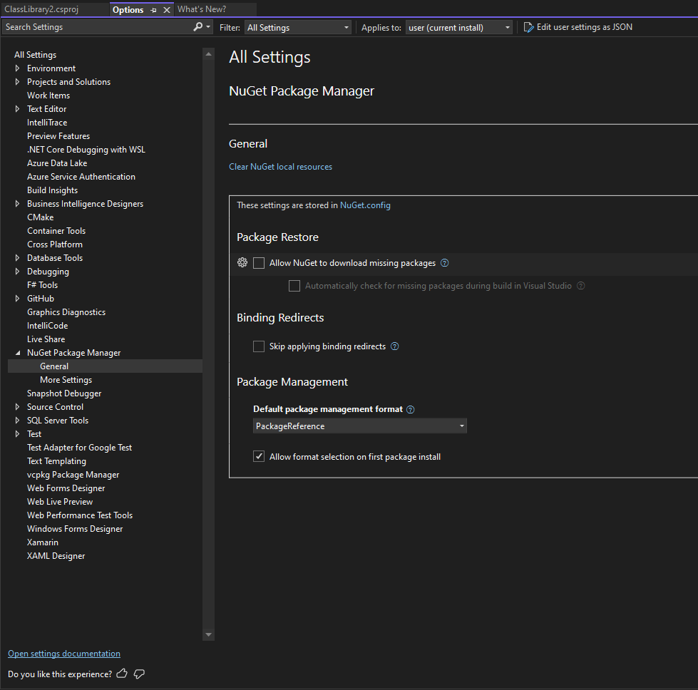
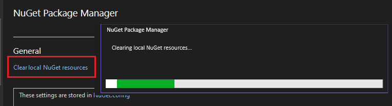

# NuGet onboarding to Unified Settings in Visual Studio
<!-- Replace `Title` with an appropriate title for your design -->

- Donnie Goodson ([donnie-msft](https://github.com/donnie-msft))
- GitHub Issue <https://github.com/NuGet/Client.Engineering/issues/2712>

## Summary

<!-- One-paragraph description of the proposal. -->

Visual Studio Options are moving to a new user interface called "Unified Settings" (abbr. USX).
The Visual Studio (VS) IDE team is responsible for the UI controls, and individual product teams will maintain a JSON file declaring the structure and data types for settings in the IDE in addition to any custom commands.

## Motivation

<!-- Why are we doing this? What pain points does this solve? What is the expected outcome? -->

The Visual Studio Editor team created Unified Settings to make the configuration experience have a Consistent UI, scoping capabilities, and the ability to share and sync settings across devices.
A blog was published to expand on this motivation and collect feedback from the community, [Unified Settings: Share Your Feedback](https://devblogs.microsoft.com/visualstudio/unifiedsettings/).
This is currently a VS Preview-only feature.

For NuGet, the improved maintainability will reduce ad-hoc UI code and allow the team to focus on the effect of the settings, and not the UI around the settings.
The expectation is significantly less usability and accessibility issues around NuGet's VS Options because of this standardized UI.

## Explanation

### Functional explanation

<!-- Explain the proposal as if it were already implemented and you're teaching it to another person. -->
<!-- Introduce new concepts, functional designs with real life examples, and low-fidelity mockups or  pseudocode to show how this proposal would look. -->

All of NuGet's legacy VS Options pages will be migrated to USX.
The General page will be tackled first, and is the main scope for this spec.

Normally, USX manages user settings in a custom JSON settings file; however, NuGet will instead continue to use our custom `NuGet.Config` to store settings values.
We will maintain interoperability with our backing store by implementing an External Settings API provided by the VS IDE team.

A mockup of the NuGet General Options page in Unified Settings is shown below.

### Settings are stored in NuGet.Config

Since the `NuGet.Config` is an external backing store, NuGet.Client can specify explanatory text and a hyperlink button that points to its location.
The text shown in the mockup is "These settings are stored in NuGet.config".
Pressing the hyperlink button on `NuGet.Config` will open the file in the VS editor.

Given that there can be multiple `NuGet.Config` files, the plan for now is to have it open the first `NuGet.Config` which is closest to the solution, which would be the first file listed in the "Configuration Files" page of NuGet's legacy settings, today.

#### Clear Local NuGet Resources

The `Clear local NuGet resources` button from legacy options will be shown as a hyperlink button in USX under the root section's title ("General").

Pressing the hyperlink button will open a modal dialog window indicating the status of the operation of clearing the resources from disk.
The mockup below shows the button and the effect of pressing it:

#### Error messages

When the `NuGet.Config` has an invalid value, the UI will show a blank selection, or unchecked checkbox, and will be accompanied by a simple error message indicating that the value in the backing store was somehow invalid.

Any action taken inside the USX page will overwrite that invalid value in the backing store (`NuGet.Config`) according to `NuGet.Configuration`.

For any fatal errors, such as unable to load the `NuGet.Config` at all due to parsing errors, or similar, then an error message will be shown under the "General" section label.

#### Help icons

Each UI element in USX can have a help link attached.
In the mockup, these are shown as a circled `?` icon.
Pressing one of these opens the relevant Documentation page, and is anchored to the corresponding section in the document.

### Technical explanation

<!-- Explain the proposal in sufficient detail with implementation details, interaction models, and clarification of corner cases. -->

### Registration

The NuGet.Client repository will maintain a `registration.json` file to declare all VS Settings, including localizible names, data types, default values, command implementations, and any dependencies among the values of other settings.

The `registration.json` will use the `"type": "external"` mode because our product stores configuration in a custom backing store: One or more `NuGet.Config` files.

### Command: Clear Local Resources

NuGet.Client will create a new modal dialog will be developed to indicate that the Clear Local Resources command is in-progress and has completed.
The modal dialog will replace our WinForms controls that indicate the same information.

Since USX doesn't support dynamically changing text blocks, the modal is the simplest and most effective form of UI we can adopt, while also allowing us to expand the capabilities of this command in VS in the future.

The invocation of the `LocalsCommandRunner` which is supported by legacy VS settings will be adapted to a USX Command.
A USX Command invokes a command in VS using the VS SDK and the extensible menu command system.
Therefore, our Visual Studio Command Table (VSCT) file will be updated with a new command, which executes `LocalsCommandRunner` in the following way:

1. Open a modal dialog window.
    - State that NuGet resources are being cleared.
    - Prevent the user from accessing VS components like the Restore or the NuGet Package Manager since this could cause conflicts with the operation of clearing local resources.
    - Show an indeterminate progress indicator.
    - A Cancel button cannot be supported at this time.
    (See Future Possibilities)
1. Execute `LocalsCommandRunner` in the same manner as legacy VS Settings.
1. Display text indicating the completion of the command (or any error messages) and a close button on the modal dialog.

### External Settings API

To map each of our registered UI elements in Unified Settings to the `NuGet.Configuration` APIs, we must implement an `IExternalSettingsProvider`.
USX will invoke the following on our provider:
- `GetValueAsync` is called by USX when obtaining values from the `NuGet.Configuration`.

- `SetValueAsync` is called by USX when the user has made a change to the setting and it needs to be persisted in the backing store.

The provider will respond to those API calls using the following `NuGet.Configuration` types for retrieving and persisting NuGet Configuration data:

- BindingRedirectBehavior
- PackageRestoreConsent
- PackageManagementFormat

Other notes:
- The provider is exported by providing GUID in the `registration.json`.

- The `ISettings` service will be obtained by the provider using ServiceLocator.

- Any `SettingsChanged` events will invalidate the provider's state and cause USX to repopulate the page's data.

## Drawbacks

<!-- Why should we not do this? -->
No drawbacks have been identified.

## Rationale and alternatives

<!-- Why is this the best design compared to other designs? -->
<!-- What other designs have been considered and why weren't they chosen? -->
<!-- What is the impact of not doing this? -->
- The Clear Local Resources command could first open the modal dialog and provide a "start" button to allow the customer to begin the process of clearing the resources.
This would be a change from the legacy behavior, but customers may be curious about the new USX experience, and initiate the command by mistake.

## Prior Art

<!-- What prior art, both good and bad are related to this proposal? -->
<!-- Do other features exist in other ecosystems and what experience have their community had? -->
<!-- What lessons from other communities can we learn from? -->
<!-- Are there any resources that are relevant to this proposal? -->

To achieve parity with the legacy Visual Studio Options for NuGet, those UI elements and implementation will serve as a starting point for the migration to Unified Settings.

## Unresolved Questions

<!-- What parts of the proposal do you expect to resolve before this gets accepted? -->
<!-- What parts of the proposal need to be resolved before the proposal is stabilized? -->
<!-- What related issues would you consider out of scope for this proposal but can be addressed in the future? -->

No questions have been identified.

## Future Possibilities

<!-- What future possibilities can you think of that this proposal would help with? -->

- `LocalsCommandRunner` could be enhanced to support Cancellation.
This would allow the modal dialog shown from our USX command to provide a `Cancel` button in case the user decides not to wait on a large delete operation to complete and block usage of VS.